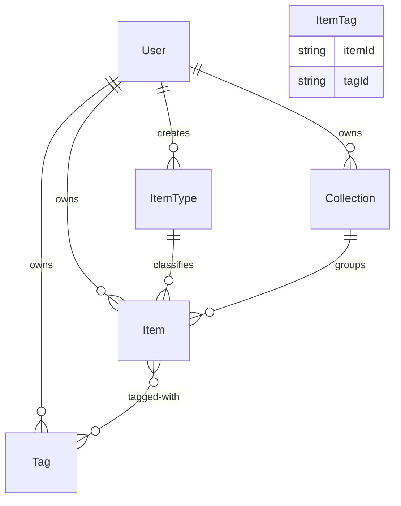
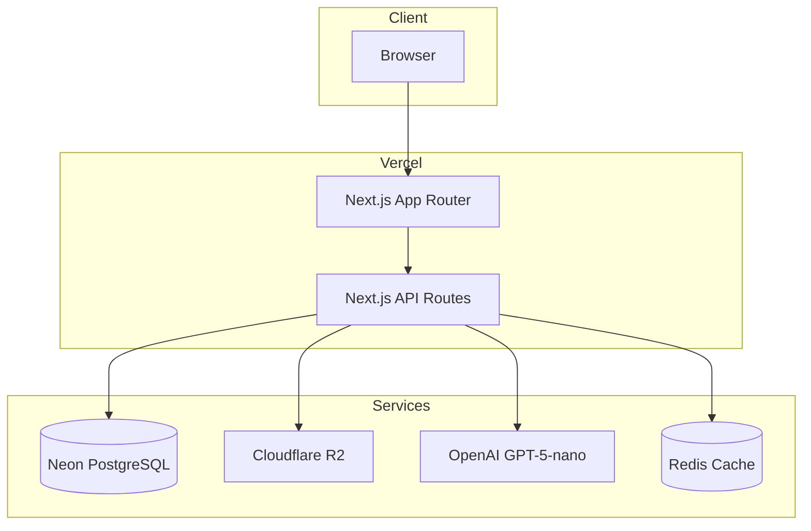
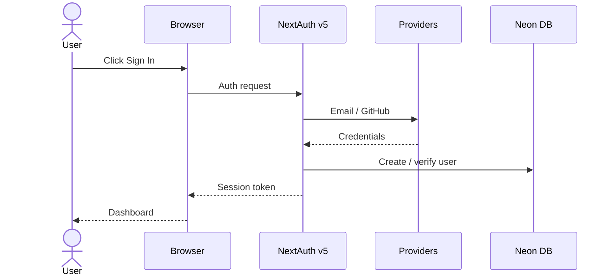
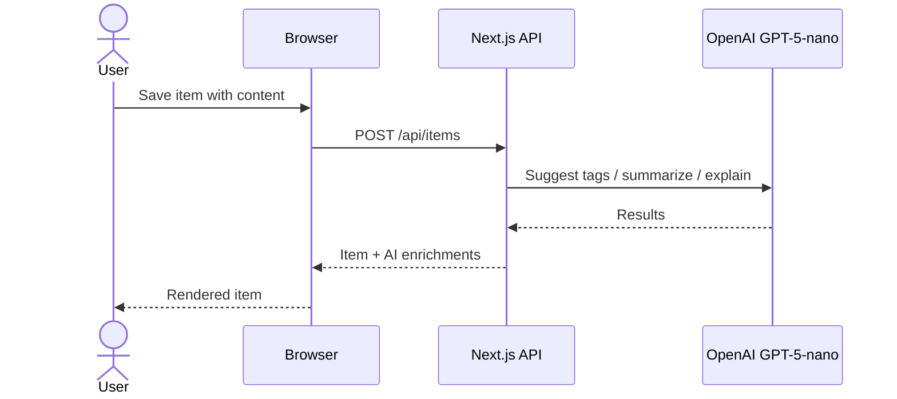

# 🗄️ DevStash — Centralized Developer Knowledge Hub

Store snippets, prompts, docs, commands, and more in one searchable, AI‑enhanced hub.

---

## 📌 Problem

Developers scatter essentials everywhere:

| Stored In | Examples |
|-----------|---------|
| VS Code / Notion | code snippets |
| AI chats | prompts, context files |
| Bookmarks | useful links |
| Random folders | docs |
| `.txt` files | commands |
| GitHub Gists | project templates |
| Bash history | terminal commands |

**Result** → context switching, lost knowledge, inconsistent workflows.

**DevStash** → one searchable, AI‑powered hub for all dev knowledge.

---

## 🧑‍💻 User Personas

| Persona | Needs |
|---------|-------|
| Everyday Developer | Quick access to snippets, commands, links |
| AI‑First Developer | Store prompts, workflows, contexts |
| Content Creator / Educator | Course notes, reusable code |
| Full‑Stack Builder | Patterns, boilerplates, API references |

---

## ⚡ Core Features

### A) Item System (Built‑in Types)

```
📄 Snippet  💬 Prompt  📝 Note
🔧 Command  📎 File    🖼️ Image  🔗 URL
```

Custom item types → Pro tier only.

### B) Collections

Group **mixed item types** into themed collections:

```
📁 React Patterns
📁 Context Files
📁 Python Snippets
```

### C) 🔍 Search

Full‑text search across: titles, content, tags, types.

### D) 🔐 Authentication

- Email + password
- GitHub OAuth (NextAuth v5)

### E) Additional Features

- ⭐ Favorites & pinned items
- 🕐 Recently used
- 📥 Import from files
- ✍️ Markdown editor for text items
- 📤 File uploads (images, docs, templates)
- 📦 Export (JSON / ZIP)
- 🌙 Dark mode (default)

### F) 🤖 AI Superpowers

| Feature | Description |
|---------|-------------|
| Auto‑tagging | Suggest tags from content |
| AI Summaries | Concise item summaries |
| Explain Code | Natural‑language code breakdown |
| Prompt Optimization | Improve stored prompts |

> AI engine: **OpenAI GPT‑5‑nano**

---

## 🗄️ Data Model (Prisma)

```prisma
// ── User ──────────────────────────────────────────────
model User {
  id                   String   @id @default(cuid())
  email                String   @unique
  password             String?
  isPro                Boolean  @default(false)
  stripeCustomerId     String?
  stripeSubscriptionId String?

  items       Item[]
  itemTypes   ItemType[]
  collections Collection[]
  tags        Tag[]

  createdAt DateTime @default(now())
  updatedAt DateTime @updatedAt
}

// ── Item ──────────────────────────────────────────────
model Item {
  id          String   @id @default(cuid())
  title       String
  contentType String   // "text" | "file"
  content     String?  // used when contentType = "text"
  fileUrl     String?
  fileName    String?
  fileSize    Int?
  url         String?
  description String?
  language    String?
  isFavorite  Boolean  @default(false)
  isPinned    Boolean  @default(false)

  userId String
  user   User @relation(fields: [userId], references: [id])

  typeId String
  type   ItemType @relation(fields: [typeId], references: [id])

  collectionId String?
  collection   Collection? @relation(fields: [collectionId], references: [id])

  tags ItemTag[]

  createdAt DateTime @default(now())
  updatedAt DateTime @updatedAt
}

// ── ItemType ──────────────────────────────────────────
model ItemType {
  id       String  @id @default(cuid())
  name     String
  icon     String?
  color    String?
  isSystem Boolean @default(false)

  userId String?
  user   User? @relation(fields: [userId], references: [id])

  items Item[]
}

// ── Collection ────────────────────────────────────────
model Collection {
  id          String   @id @default(cuid())
  name        String
  description String?
  isFavorite  Boolean  @default(false)

  userId String
  user   User @relation(fields: [userId], references: [id])

  items Item[]

  createdAt DateTime @default(now())
  updatedAt DateTime @updatedAt
}

// ── Tag ───────────────────────────────────────────────
model Tag {
  id     String @id @default(cuid())
  name   String
  userId String
  user   User @relation(fields: [userId], references: [id])

  items ItemTag[]
}

// ── ItemTag (M‑to‑M join) ─────────────────────────────
model ItemTag {
  itemId String
  tagId  String

  item Item @relation(fields: [itemId], references: [id])
  tag  Tag  @relation(fields: [tagId], references: [id])

  @@id([itemId, tagId])
}
```

### Entity Relationship



---

## 🧱 Tech Stack

| Category     | Choice                           |
|-------------|----------------------------------|
| Framework   | Next.js 16 (React 19 / App Router) |
| Language    | TypeScript                       |
| Database    | Neon (PostgreSQL) + Prisma ORM   |
| Caching     | Redis *(optional)*               |
| File Store  | Cloudflare R2                    |
| CSS / UI    | Tailwind CSS v4 + shadcn/ui      |
| Auth        | NextAuth v5 (email + GitHub)     |
| AI          | OpenAI GPT‑5‑nano                |
| Deployment  | Vercel                           |
| Monitoring  | Sentry *(planned)*               |

---

## 💰 Monetization

| Plan  | Price            | Limits                  | Features                                        |
|-------|------------------|-------------------------|-------------------------------------------------|
| Free  | $0               | 50 items, 3 collections | Basic search, image uploads, no AI              |
| Pro   | $8/mo · $72/yr   | Unlimited               | File uploads, custom types, AI features, export |

> Stripe subscriptions + webhook sync.

---

## 🎨 UI / UX

- 🌙 Dark mode first, minimal dev‑focused UI
- 🖥️ Syntax highlighting for code blocks
- Inspired by **Notion**, **Linear**, **Raycast**

### Layout

```
┌──────────────────────────────────────────┐
│  📂 Sidebar (collapsible)  │  Main Grid │
│  ─ Filters & Collections   │  / List    │
│  ─ Tags                    │  Workspace │
│  ─ Favorites               │            │
│  ─ Pinned                  │            │
│                            │  Full‑scr. │
│                            │  Editor    │
│                            │  (modal)   │
└──────────────────────────────────────────┘
```

- **Mobile**: sidebar becomes a drawer; touch‑optimized controls.

---

## 🔌 System Architecture



---

## 🔐 Auth Flow



---

## 🧠 AI Feature Flow



---

## 🗂️ Development Workflow

- **One branch per lesson** so students can follow & compare:

```bash
git switch -c lesson-01-setup
```

- AI assistance via **Cursor / Claude Code / ChatGPT**
- GitHub Actions for CI *(optional)*

---

## 🧭 Roadmap

### MVP
- [x] Items CRUD
- [ ] Collections
- [ ] Search
- [ ] Basic tags
- [ ] Free‑tier limits enforcement

### Pro Phase
- [ ] AI features (auto‑tagging, summaries, explain code, prompt optimization)
- [ ] Custom item types
- [ ] File uploads (R2)
- [ ] Export (JSON / ZIP)
- [ ] Stripe billing & upgrade flow

### Future
- [ ] Shared collections
- [ ] Team / Org plans
- [ ] VS Code extension
- [ ] Browser extension
- [ ] Public API + CLI tool

---

## 📦 Getting Started

```bash
git clone <repo>
npm install
npm run dev
```

> **Status**: 🟡 In planning — ready for environment setup & UI scaffolding.

---

🏗️ **DevStash — Store Smarter. Build Faster.**
